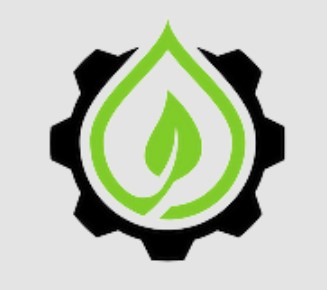

  

# EcoClear  
**Acolher é o primeiro passo para transformar**

## ✨ Objetivo  

A **EcoClear** é uma inovadora plataforma digital desenvolvida com o objetivo de monitorar empresas e suas emissões atmosféricas, com foco especial na liberação de gases tóxicos. Sua principal finalidade é acompanhar e registrar os poluentes emitidos por atividades industriais, oferecendo dados confiáveis e em tempo real.  

O propósito central da EcoClear é **contribuir para a redução da poluição ambiental** por meio do controle rigoroso das emissões. Ao identificar fontes de contaminação e promover maior transparência nas práticas corporativas, a plataforma estimula mudanças positivas nas rotinas produtivas.

## ❌ Problema  

A poluição industrial continua sendo uma das principais causas de degradação ambiental e de riscos à saúde da população. Um dos maiores desafios enfrentados atualmente é a **ausência de sistemas eficazes de monitoramento em tempo real** dentro das empresas, o que compromete o controle adequado das emissões de poluentes.

## 💻 Tecnologias Utilizadas  

- **Linguagens de Programação**  
  - JavaScript  
  - HTML  
  - CSS  

- **Sensores e Dispositivos**  
  - Sensores de Gás  
  - Sensores de Temperatura  
  - Dispositivos IoT para monitoramento em tempo real  

## 📝 Entregas  

- MER  
- DER  
- Diagrama de Classes  
- Dicionário de Dados  
- Documento de Requisitos  
- Banco de Dados Físico  
- Apresentação  
- Front-End Web  
- Front-End Mobile  
- Integração de telas:
  - Notícias  
  - Cadastro  
  - Login  
  - Perfil  
  - Monitoramento  
  - Contato  

## 🚀 Sprints  

### 🟢 Sprint 1  
- Tela de cadastro (Desktop)  
- Tela de login (Desktop)  
- Tela inicial  
- Sobre nós  
- Notícias  
- Contatos  
- Tela inicial (Mobile)  
- Home (Mobile)  
- Protótipo IoT  

### 🟡 Sprint 2  
- Monitoramento em tempo real (Desktop, Mobile e IoT)  
- Perfil (Desktop e Mobile)  
- Tela de login e cadastro (Mobile)  
- Administrador (Desktop)  
- Tela de relatórios (Mobile)  
- Gráficos (Mobile)  

### 🔵 Sprint de Integração  
- Integração das estruturas de banco de dados com o site (Desktop)  

  
- Integração das estruturas de banco de dados com o aplicativo (Mobile) e dispositivos IoT  

## 👩‍💻 Integrantes  

- **Ana Livia** — Banco de Dados  
- **Maria Fernanda** — Banco de Dados  
- **Fernanda** — Front-End  
- **Leticia** — Front-End  
- **Murilo** — Back-End  
- **Pedro** — Back-End  
- **Lorena** — Scrum Master, Full-Stack  
- **Sophia** — PO, Full-Stack  

## 🌱 Informações Adicionais  

Por meio da tecnologia e do monitoramento ambiental, a plataforma contribui para uma sociedade **mais justa, inclusiva e sustentável**, alinhando **inovação com responsabilidade social**.

----

  

# EcoClear  
**Welcoming is the first step to transformation**

## ✨ Objective  

**EcoClear** is an innovative digital platform developed to monitor companies and their atmospheric emissions, with a special focus on the release of toxic gases. Its main purpose is to track and record pollutants emitted by industrial activities, providing reliable and real-time data.  

EcoClear's core mission is to **contribute to the reduction of environmental pollution** through strict emission control. By identifying sources of contamination and promoting greater transparency in corporate practices, the platform encourages positive changes in production routines.

## ❌ Problem  

Industrial pollution remains one of the main causes of environmental degradation and health risks to the population. One of the biggest challenges currently faced is the **lack of effective real-time monitoring systems** within companies, which hinders proper control of pollutant emissions.

## 💻 Technologies Used  

- **Programming Languages**  
  - JavaScript  
  - HTML  
  - CSS  

- **Sensors and Devices**  
  - Gas Sensors  
  - Temperature Sensors  
  - IoT Devices for real-time monitoring  

## 📝 Deliverables  

- ER Model  
- Relational Model  
- Class Diagram  
- Data Dictionary  
- Requirements Document  
- Physical Database  
- Presentation  
- Front-End Web  
- Front-End Mobile  
- Screen integration:
  - News  
  - Registration  
  - Login  
  - Profile  
  - Monitoring  
  - Contact  

## 🚀 Sprints  

### 🟢 Sprint 1  
- Registration screen (Desktop)  
- Login screen (Desktop)  
- Home screen  
- About us  
- News  
- Contacts  
- Initial screen (Mobile)  
- Home (Mobile)  
- IoT Prototype  

### 🟡 Sprint 2  
- Real-time monitoring (Desktop, Mobile, and IoT)  
- Profile (Desktop and Mobile)  
- Login and registration screens (Mobile)  
- Admin panel (Desktop)  
- Reports screen (Mobile)  
- Charts (Mobile)  

### 🔵 Integration Sprint  
- Database structure integration with the website (Desktop)  

### 🟣 Second Semester  
- Database structure integration with the app (Mobile) and IoT devices  

## 👩‍💻 Team Members  

- **Ana Livia** — Database  
- **Maria Fernanda** — Database  
- **Fernanda** — Front-End  
- **Leticia** — Front-End  
- **Murilo** — Back-End  
- **Pedro** — Back-End  
- **Lorena** — Scrum Master, Full-Stack  
- **Sophia** — PO, Full-Stack  

## 🌱 Additional Information  

Through technology and environmental monitoring, the platform contributes to a **fairer, more inclusive, and sustainable society**, aligning **innovation with social responsibility**.
